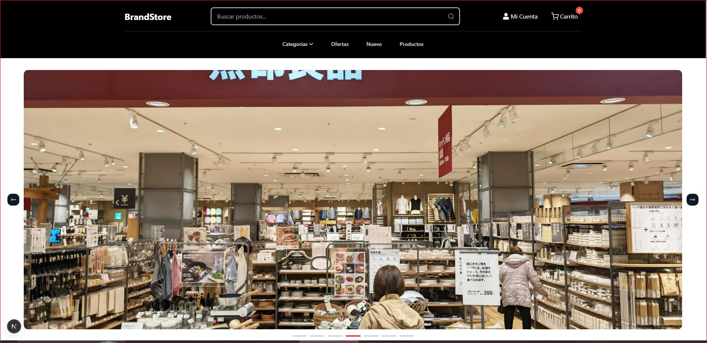
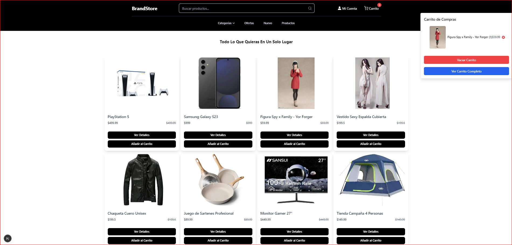
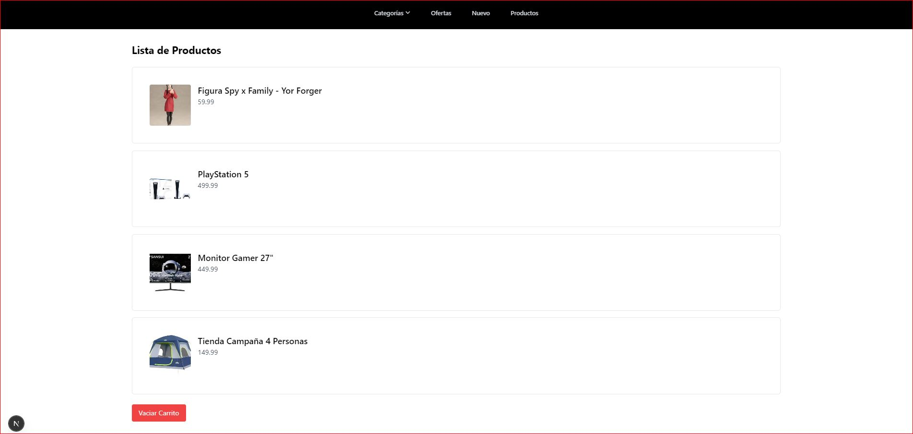
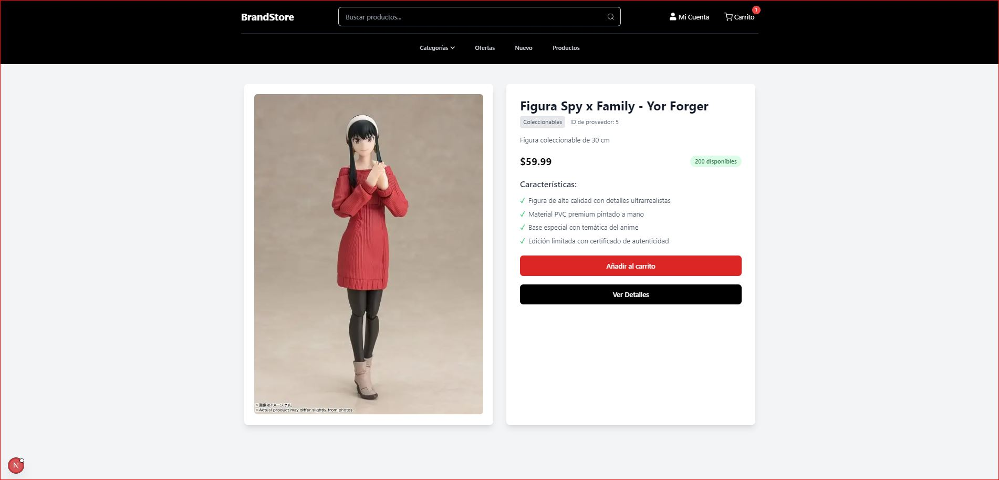

# 🛍️ Tienda Online Completa 🛍️

Este proyecto integra una potente API Realizada con FastApi y NextJS para el Front.

---

## 🚀 Accede a los Componentes Principales de la Tienda:

| Componente | Descripción | Enlace al Repositorio |
| :--------- | :---------- | :-------------------- |
| **🌐 Frontend (Tienda Web)** | Interfaz de usuario interactiva y experiencia de compra para los clientes. | [Ir al Repositorio del Frontend](https://github.com/DunaCoder/Front-Next) |
| **⚙️ Backend (API de la Tienda)** | Lógica de negocio, gestión de productos, usuarios y procesamiento de pedidos. | [Ir al Repositorio del Backend](https://github.com/DunaCoder/FULL-STORE-API) |

---

## ✨ Visión General del Proyecto

Este proyecto es una pratica de un E-comerce Realizado con NextJS y Python con FastApi, el proyecto busca realiza operaciones get put update y delete, por parte del Front End
esta realizado con NextJS, posee funciones basicas de un carrito de compras una interfaz que busca ser intuitiva y con el tiempo se agregaran mas funciones en el Front.

---

## 📸 Demostración Visual de la Tienda

### Página principal


Aquí puedes ver la interfaz principal de nuestra tienda en línea, con los productos destacados y la barra de navegación.

---

### Página de productos


Explora todos los productos disponibles en nuestra tienda. Utiliza los filtros para encontrar rápidamente lo que buscas.

---

### Página del carrito de compras


Revisa los artículos que has añadido a tu carrito, ajusta las cantidades o procede al pago.

---

### Página de detalles del producto


Obtén una vista ampliada y detalles específicos de cada producto, incluyendo descripciones, precios y opciones de compra.

---
## ⚙️ Tecnologías Clave

Un resumen de las tecnologías usadas en toda la solución.

* **Frontend:** React (NextJS), TypeScript, Tailwind CSS
* **Backend:** Python, FatApi
* **Control de Versiones:** Git, GitHub

---

## 🚀 Cómo Probar la Tienda

Para ejecutar y probar la tienda completa, necesitarás configurar ambos proyectos (frontend y backend) localmente.

1.  **Configurar y Lanzar el Backend:**
    * Clona el repositorio del Backend:
        ```bash
        git clone [https://github.com/DunaCoder/FULL-STORE-API](https://github.com/DunaCoder/FULL-STORE-API)
        cd nombre-repositorio-backend
        # Sigue las instrucciones de su README.md para instalar dependencias y arrancarlo
        ```
    * Asegúrate de que el backend esté ejecutándose (ej. en `http://localhost:5000`).

2.  **Configurar y Lanzar el Frontend:**
    * Clona el repositorio del Frontend:
        ```bash
        git clone [https://github.com/DunaCoder/Front-Next](https://github.com/DunaCoder/Front-Next)
        cd nombre-repositorio-frontend
        # Sigue las instrucciones de su README.md para instalar dependencias y arrancarlo
        ```

3.  ¡Abre tu navegador y navega a la URL del frontend (normalmente `http://localhost:3000`)!

---

## 🤝 Contribuciones

Las contribuciones son bienvenidas para mejorar cualquier aspecto de la tienda. Por favor, consulta los archivos `CONTRIBUTING.md` en los repositorios de [Frontend](https://github.com/Tu-Usuario/nombre-repositorio-frontend) y [Backend](https://github.com/Tu-Usuario/nombre-repositorio-backend) para más detalles sobre cómo contribuir a cada parte.

---

## 📄 Licencia

Este proyecto está distribuido bajo la Licencia [MIT](https://opensource.org/licenses/MIT). Consulta el archivo `LICENSE` en cada repositorio individual para detalles específicos de cada componente.

---

## 📞 Contacto

* **Simón Rondón:** [Simón Rondón Martínez](https://www.linkedin.com/in/sim%C3%B3n-rond%C3%B3n-mart%C3%ADnez-6b8a64233/) | [DunaCoder](https://github.com/DunaCoder)
* **Correo Electrónico:** sipero2013@gmail.com

---

¡Gracias por revisar este proyecto! 